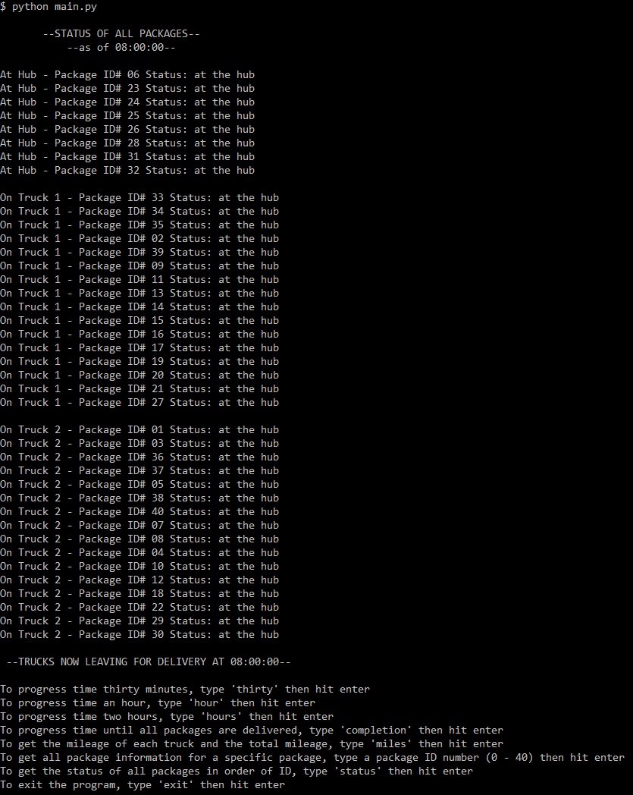
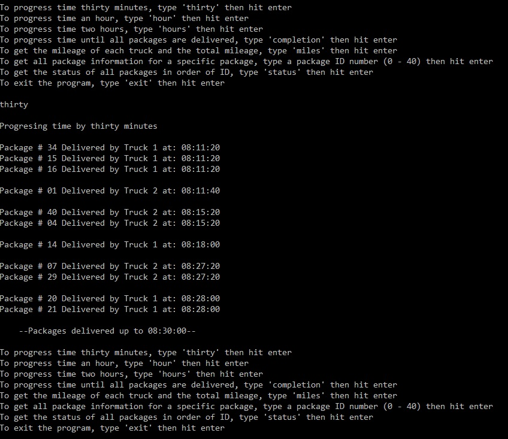
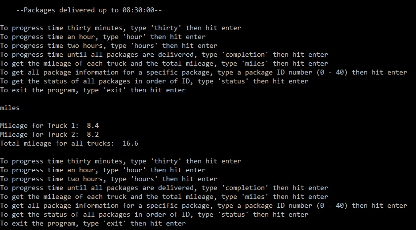
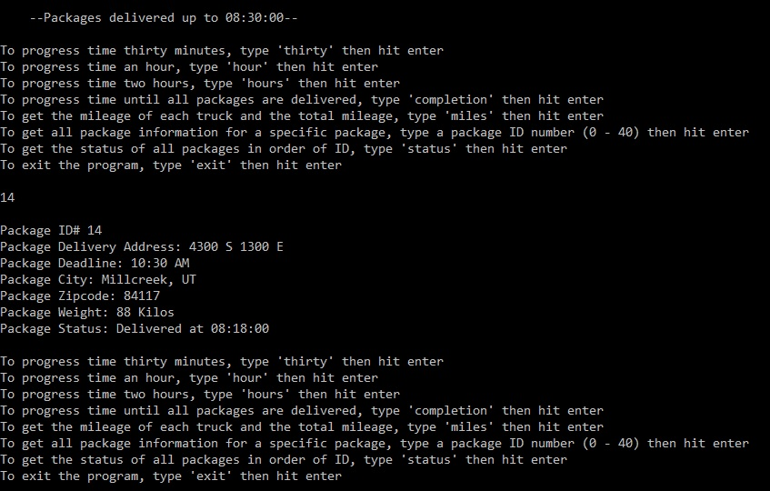
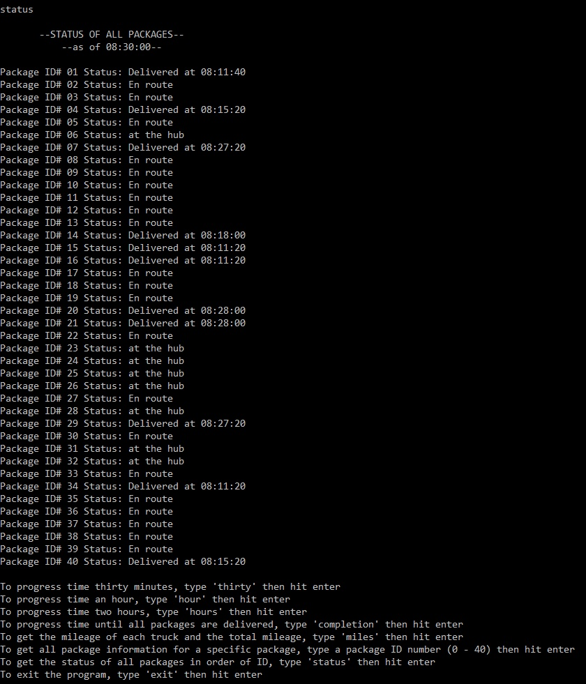

# Package-Deliveries
A project that uses Object Oriented Programming (OOP) in Python to sort and deliver packages from two trucks using Dijkstra’s shortest path algorithm. The algorithm uses a Priority Queue and the program incorporates a hash table to decrease the time complexity of some basic operations. 

## Application Description
When the main.py file is executed, the first thing the program does is read and parse the two .csv files included in the application. The distance_table_formatted.csv is parsed and used to build a matrix graph of the town where the packages are being delivered. The packages_formatted.csv is parsed and used to build a package Object for each package which are then hashed and put into a hashtable. 

The packages are then sorted into one of two trucks based first on any special instructions (for example "these two packages are to be delivered together" or  "must be delivered after/before a certain time") and then the remaining spaces are filled by packages relevant to the loaded packages. Once the trucks are fully loaded, Dijkstra's shortest path algorithm is run and each truck is then given a route that allows them to deliver their packages in a fast and efficient manner. When the program runs, all of this is calculated and the user is shown the status of packages at the hub, in Truck 1, and in Truck 2. The user is then allowed to interact with the application by using one of several features.

## Features
    • Advance Time
    • Get Truck Mileages
    • Get Specific Package Information
    • Get Status of All Packages
### Advance Time
The application contains four different commands that allow the user to advance time by different increments. The application can be advanced by 30 minutes, 1 hour, 2 hours, or until all packages have been delivered.

### Get Truck Mileages
The application allows the user to check on the mileage of both trucks at the time specified in the program. Entering the phrase "miles" into the application will display the information to the user.

### Get Specific Package Information
The user can get information on any of the packages (0-40) by inputting it's number to the application. The program will then return all of the information it has on the package which is retrieved from it's hashtable.

### Get Status of All Packages
The user can get information on all packages by inputting the command "status" into the program. Each package will be displayed in order of ID# and their status will show where the package is at the program's current time.

## Dev Team
 
* Zach Harmon [Github](https://www.github.com/zachha) - zachha@gmail.com
